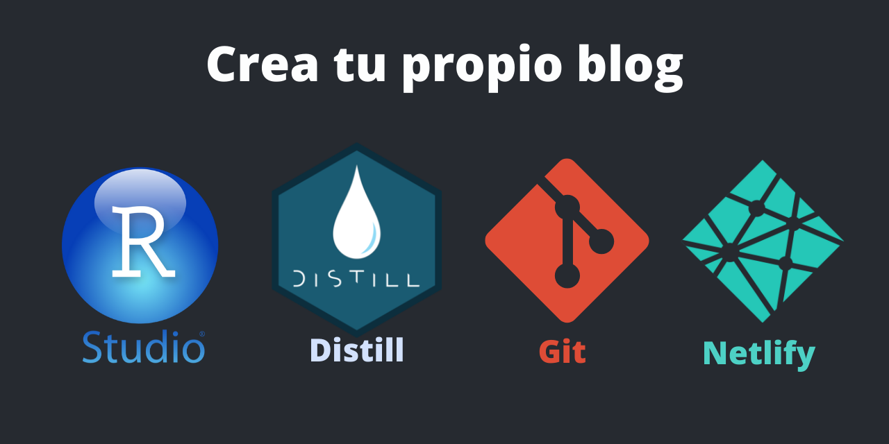

**Requisitos**:

1. Tener conocimientos básicos de Git y GitHub. Puede consultar mi anterior post sobre git y github: <https://francisco-data.netlify.app/posts/2021-12-01-intro-git-github/>

2. Tener una cuenta en Netlify (es muy sencillo de crear), debe logearse con github. <https://www.netlify.com/>

3. Tener conocimiento de RMarkdown. Aqui puede encontrar un guia completa de RMarkdown: <https://bookdown.org/yihui/rmarkdown/>


**Opcional:**

Te recomiendo visitar la documentación del **paquete Distill** para crear blogs:

<https://rstudio.github.io/distill/>

Tambien te recomiendo otro tutorial con una explicacion con videos:

<https://yuzar-blog.netlify.app/posts/2020-12-26-how-to-create-a-blog-or-a-website-in-r-with-distill-package/>


**Paso 1: Instalar el Paquete de Distill**

Abrir una sesión de Rstudio e instalar el paquete Distill

```bash
install.packages("distill")
```

**Paso 2: Crear un proyecto de Distill Blog en Rstudio**


Aqui debe especificar el nombre del directorio (que es una carpeta raiz donde se almacenará todos los archivos y subcarpetas el proyecto), también debe especificar la ruta de tu maquina (Por ejemplo: Mis Documentos) donde se almacenará la carpeta Raiz y también debes proporcionar el nombre de tu Blog (que mas adelante de puede cambiar).


Al crear el proyecto automaticamente se creará la carpeta con los archivos y subcarpetas iniciales:


**Paso 3: Ver vista previa del Blog**

En la opcion de **Build** ejecute **Build Website** para mostrar el Blog construido:


Esta es la vista previa del Blog construido: 

Puede de cerrar la ventana.


**Paso 4: Crear un Post y ejecutarlo (Knit)**

Debe ejecutar la funcion `create_post` para crear un post nuevo:

```bash
library(distill)
create_post("Mi-Primer-Post")
```


Dentro de la carpeta `_post` se almacenan todos los posts:


Una vez creado el post debe editarlo con tu propio contenido en rmarkdown y ejecutarlo (Knit).


**Paso 5: Personalizar el index.Rmd y about.Rmd e imágenes**

Puede personalizar el index.Rmd y about.Rmd y borrar la carpeta post `welcome`:


Debe crear una carpeta de `images` para mostar en el blog, las imagenes en png las puedes descargar aqui: <https://github.com/zpio/Blog_Francisco_Z/tree/main/images>


**Paso 6: editar el archivo `_site.yml`**

En el archivo `_site.yml` se configuran varias cosas. Vea la documentacion de Distill: <https://rstudio.github.io/distill/>.

La `base_url:` debe ser cambiada mas adelante con la url que personalicemos en Netlify.

La `repository_url:` debe ser cambiada mas adelante cuando se haya creado el repositorio en GitHub


```bash
name: "Blog_Francisco_Z"
title: "Francisco Z"
description: |
  Blog sobre Ciencia de Datos y Machine Learning en R
collections:
  posts:
    share: [twitter, linkedin, facebook, pinterest]
    citations: false
creative_commons: CC BY
base_url: https://github.com/zpio
repository_url: https://github.com/zpio/mi-blog-personal
favicon: images/favicon.png
rss:
  full_content: true
navbar:
  logo: images/rstudio.png
  right:
    - text: "Posts"
      href: index.html
    #- text: "Gallery"
    #  href: gallery.html
    - text: "About"
      href: about.html
    #- text: "Contributors"
    #  href: contributors.html
    - icon: fa fa-github
      href: https://github.com/zpio/
    - icon: fa fa-linkedin
      href: https://www.linkedin.com/in/pfzambra/
    - icon: fa fa-rss
      href: index.xml
output: distill::distill_article
```

Una vez configurado `_site.yml` ejecute (knit) del post, si no lo ha hecho, y vuelva a ejecutar **Build Website**:


**Paso 7: Crear el repositorio en Git**

En el menu **Tools** de Rstudio escoja la opcion **Shell** para abrir el cmd (en windows) y ejecutar los primeros comandos de git:

```bash
git init
```
```bash
git add .
```
```bash
git commit -m "creacion del blog"
```
```bash
git branch -M main
```

**Paso 8: Crear un repositorio en GitHub**


En el menu **Tools** de Rstudio escoja la opcion **Shell** para abrir el cmd (windows) y ejecutar los siguientes comandos de git para subir nuestro proyecto a GitHub:

```bash
git remote add origin https://github.com/zpio/mi-blog-personal.git
```
```bash
git push -u origin main
```


Agreguemos un archivo `README.md` como nos recomienda GitHub.

También debemos agregar un archivo sin extencion llamado `.gitignore`:


En el menu **Tools** de Rstudio escoja la opcion **Shell** para abrir el cmd (windows) y ejecutar los siguientes comandos de git para traer el readme del github a nuestro local:

```bash
git pull
```

Luego ejecute los siguientes comandos para subir el arhivo .gitignore a github:

```bash
git add .
```
```bash
git commit -m "se agrega gitignore"
```
```bash
git push origin main
```


**Paso 9: Desplegar nuestro blog en Netlify**

Crear un nuevo sitio:


Conectar con github:


Escoger el repositorio del proyecto del blog:


Configurar el **Publish directory** con el texto `_site`:


Luego, ejecutar el **deploy**.

Listo, ya está creado el sitio web con una url que se puede personalizar.


**Paso 10: Actualizar la `base_url` y `repository_url`**

Debe actualizar la `base_url` y `repository_url` del archivo `_site.yml` como se menciona en el paso 6.

Luego, subir los cambios a github:

```bash
git add .
```
```bash
git commit -m "se actualiza base_url y repository_url"
```
```bash
git push origin main
```
La actualizacion de la pagina en Netlify se hace forma automatica.


