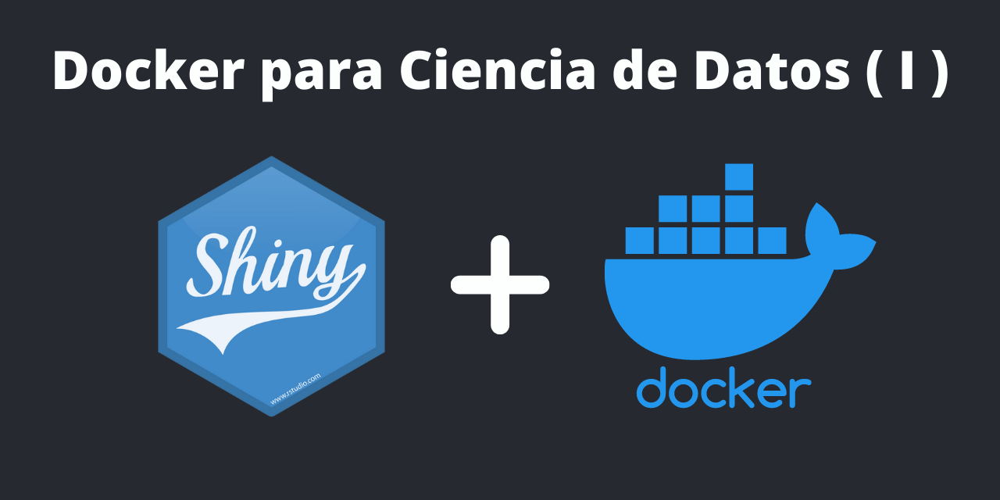

**La Ciencia de Datos va cambiando**

La **Ciencia de Datos** está cambiando, hacia una Ciencia de Datos distribuida y requiere de conocimientos en: **Docker**, **Git** y **Apps**. No basta un informe para toma de desiciones sino apliaciones para mejorar la toma de desiciones.

**Como Docker ayuda a la Ciencia de Datos**

Docker ayuda a la Ciencia de Datos a poder desplegar o ejecutar aplicaciones sin importar donde se implementen, significa que no tiene que lidiar con problemas de "funciona en mi máquina", es decir, ayuda resolver el problema de la reproducibilidad. Veamos un ejemplo:

La siguiente **app** fue desarrollada con **Shiny**, que es un paquete de R que permite construir aplicaciones web interactivas a partir de scripts de R, que obtiene datos de google trends y luego con varios modelos, entre ellos Arima, ayudan a pronosticar la tendencia. Una app sencilla de realizar en shiny.

Esta app utiliza un versión de **R**, **paquetes** y **dependencias** específicas que he instalado en mi máquina personal. En muchisisimas ocaciones hay apps que **no funcionan en cualquier máquina** debido a paquetes o dependencias que se requiere instalar. Me ha pasado a mi y muchas personas el famoso: **"en mi maquina si funcionaba"**. Sin olvidar mencionar que muchas veces hay que **configurar un servidor** para desplegar la aplicación para que funcione correctamente. Por ejemplo, configurar un **server en AWS** para desplegar la app Shiny y esté accesible a todo el mundo podría ser un procedimiento un poco engorroso.

**Docker entra al escenario**:

Docker es maravilloso, puedo crear un **entorno aislado** con todos los paquetes y dependencias para que funcione la app en cualquier maquina personal o servidor en la nube. 

Esta es una muestra de la app que puede ejecutarse en cualquier máquina o servidor en la nube. Solo basta con tener instalado Docker y descargarse algo que se llama **imagen** y correr la app.

**Algunos conceptos y terminos importantes**

**¿Qué es Docker?**

**Docker** es un **software** que automatiza el despliegue de aplicaciones dentro de **contenedores de software**, proporcionando una **capa** adicional de **abstracción** y **automatización** de virtualización de aplicaciones en múltiples sistemas operativos. En palabras sencillas, es un entorno que permite correr aplicaciones en cualquier lugar, eliminando el clásico **"en mi computadora si funciona"**.

**¿Qué es un Contenedor o Container en Docker?**

Un container es una unidad de software estandarizada que “**empaqueta el código y todas sus dependencias** para que la aplicación se ejecute de forma rápida y de forma viable, de un entorno a otro”.

**¿Qué diferencia hay entre los contenedores de Docker y las máquinas virtuales?**

Los **containers virtualizan el sistema operativo**, y no el hardware. Es decir, son una **abstracción** en la capa de la aplicación que empaquetan el código y sus dependencias. De esta forma, múltiples contenedores pueden ejecutarse en la misma máquina y compartir el núcleo del sistema operativo con otros contenedores que ejecutan sus procesos de forma aislada.

Las **máquinas virtuales** son una abstracción de hardware físico que convierte 1 servidor en muchos servidores.
En la maquinas virtuales toda la **infraestructura** de nuestro sistema, y encima, instalamos el **Hypervisor** que se encarga de crear la capa de virtualización y manejar los recursos de ram, cpu, etc. Encima de este tenemos un completo **sistema operativo corriendo** y, con este, dependencias y librerías para que nuestras aplicaciones funcionen correctamente.

**¿Dónde puedo correr Docker?**

Es **multiplataforma**, puede correr en: Windows, Mac, Linux, Datacenter, servidores en la nube, e incluso en máquinas virtuales.

**¿Qué son las imágenes en Docker?**

Una **imagen Docker** es un archivo que se utiliza como plantilla para crear contenedores. Con una imagen de base se crean nuevas imágenes y crear contenedores, es decir, un contenedor puede tener varias capas de imágenes superpuestas.

Las imágenes las podemos encontrar en diferentes repositorios privados o públicos, el más conocido es el **Docker Hub** <https://hub.docker.com/>. Básicamente lo que hace es descargar la imagen y utilizarlo creando las diferentes capas para que una aplicación funcione.

**¿Cuál es la Arquitectura de Docker?**

Docker utiliza la arquitectura **cliente servidor**, donde tenemos un **Docker deamon**, que es el servidor el cual expone una API para que el Docker CLI se pueda comunicar. El servidor es quien se encarga de hacer la parte pesada de creación, ejecución y distribución de los contenedores, imágenes, etc.

**Docker deamon:** Es un proceso(servicio) que corre en segundo plano.

**REST API**: Lo pueden usar los programas para comunicarse con el deamon.

**Docker CLI**: Una aplicación de consola que usa la REST API para interactuar con el deamon.

**Cómo puedo empezar con Docker?**

Hay un curso muy práctico para aprender sobre Docker desde cero en la plataforma EDTEAM:

Si accedes con el siguiente link o con el codigo: 342602, obtienes descuentos en tu suscripción:

<https://ed.team/premium?cupon=REF-342602>

