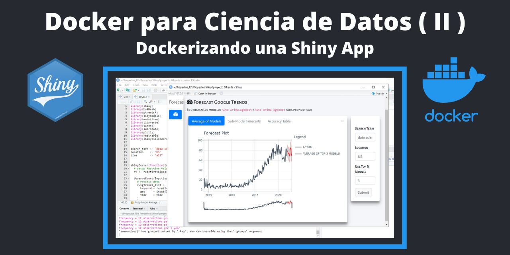
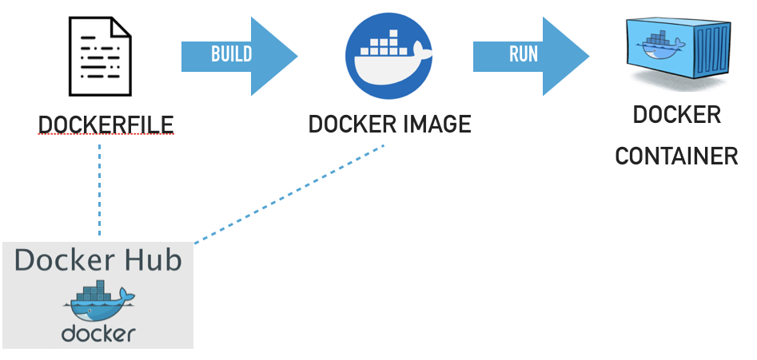
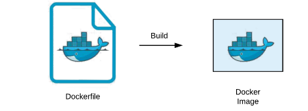

En el [**blog anterior**](https://francisco-data.netlify.app/posts/2021-12-14-docker-ds-part-1/) sobre **Docker para Ciencia Datos** se hizo un breve introducción de los principales terminos de **Docker** y las bondades de crear **entornos aislados** para **ejecutar** un aplicación de **Shiny**.

Los dashboards en Shiny son una herramienta muy poderosa, pero un desafío importante es la implementación (**deployment**). 

Hoy quiero hacer un breve explicación de como dockerizar una shiny app del [**blog anterior**](https://francisco-data.netlify.app/posts/2021-12-14-docker-ds-part-1/) que sea más fácil de reproducir, implementar y escalar.


**Por qué se usa Docker?**


En Docker existe algo que se llama **contenedor** que es un **entorno aislado** para ejecutar una aplicación, es decir, solo se emula un sistema operativo **Linux** mas las bibliotecas. Un **contenedor** es más **liviano** que una **máquina virtual** ya que solo se utilizan los recursos asignados al contenedor y el entorno creado es el mismo. El objetivo final es poder utilizar la shiny app y que esté disponible para cualquier usuario.


**Construyendo una imagen para la Shiny App**



Los contenedores, para poder ver en vivo nuestra Shiny app, se crean a partir de imágenes que se definen mediante instrucciones en un archivo llamado **Dockerfile**. 

Ahora, vamos a contruir una imagen para nuestra Shiny App a partir de una imagen base.


**Paso 1. Tener el proyecto de la app terminada:**


Es este caso la aplicación Shiny ya está terminada y la tengo en la carpeta **proyecto GTrends** que vendría ser la **carpeta raiz** del proyecto, que contiene los archivos principales **ui.R** y **server.R** y la carpeta **www** que solo sirve para embellecer de la interfaz del usuario. 

Ademas existen otros archivos que se explica mas adelante. Por el momento, los archivos **.gitignore** y **README.md** los utilizo porque tengo proyectado subir este repositorio a GitHub y sea público, el archivo **.gitignore** sirve para no mostrar ciertos archivos al publico y **README.md** para mostrar alguna documentación del proyecto.


**Paso 2. El archivo Dockerfile**




En la carpeta raiz del proyecto debe tener un archivo **Dockerfile**. Este archivo contiene las intrucciones para contruir la imagen.

Los contenedores se contruyen a partir de imagenes base, contextualizado un poco, una imagen base para una shiny app pueden ser: **el programa R** mas las **bibliotecas de linux**  mas el paquete **Shiny**. En el archivo Dockerfile se debe especificar la imagen base a usar. Por suerte, existen muchas **imagenes bases** ya construidas para proyectos con **Shiny** y ciertos paquetes de **R** ya listo para descargar desde el repositorio de [**Dockerhub**](https://hub.docker.com/).

En este caso voy a utilizar la imagen **rocker/tidyverse:latest** que es una imagen pública del [**Dockerhub**](https://hub.docker.com/r/rocker/tidyverse) que contiene una versión estable de R, RStudio y algunos paquetes de R.

Con el comando FROM se especifica la imagen base de partida
```bash
FROM rocker/tidyverse:latest
```

Con el comando COPY se indica que copie los archivos del proyecto de mi carpeta local (esto se indica con un punto) a la carpeta del contenedor `/GT_Dashboard` que crearemos.
```bash
COPY . /GT_Dashboard
```

El comando WORKDIR es para definir el directorio de trabajo del contenedor que contiene los archivos del proyecto shiny que mas tarde se ejecutarán.
```bash
WORKDIR /GT_Dashboard
```

El comando EXPOSE indica que el contenedor se puede conectar al puerto indicado al ejecutarse.
```bash
EXPOSE 5024
```

Debido que la Shiny App tiene algunos paquetes como **shinydashboard**, **bs4Dash**, **gtrendsR**, **tidymodels**, y muchas mas, hay que indicarle al **Dockerfile** los paquetes de R a instalar para que funcione la Shiny App. Por suerte, cuando se usa imagenes de **Rocker** se puede usar una sintaxis sencilla para listar los paquetes, estos deben comenzar con **RUN install2.r --error \** que es como una envoltura de paquetes de R a instalar.

```bash
RUN install2.r --error \
    shiny \
    shinydashboard  \
    bs4Dash  \
    gtrendsR  \
    tidymodels  \
    modeltime  \
    timetk  \
    plotly  \
    reactable  \
    shinycssloaders  \
    lubridate
```

Luego, al docker file hay que indicarle que archivo de R debe ejecutarse para mostrar la Shiny App. 
```bash
CMD ["Rscript", "starter.R"]
```
En mi caso tengo un archivo **starter.R** que contiene el comando de R para ejecutar la shiny app.

```bash
library(shiny)
shiny::runApp('./', port = 5024, host="0.0.0.0")
```

**Paso 3. Construir la imagen**

Una vez definido el archivo **Dockerfile** hay mandar a contruirlo ejecutando en la terminal (en la carpeta raiz del proyecto) el siguiente comando:

```bash
docker build -t pfzambra/fgtrends .
```
El texto **pfzambra/fgtrends** es el nombre de la imagen que quieres darle. En mi caso lo nombro así debido que voy a subir la imagen al repositorio de **DockerHub** (debe tener: <usuario-dockerhub/nombre-app>).

La construcción de la imagen puede tomar varios minutos.

Con el siguiente comando podemos listar las imagenes que hemos creado:

```bash
docker images
```


**Paso 3. Ejecutar el contenedor**

Esta parte es la mas interesante ya que podemos ver nuestra Shiny App implementada. Hay que ejecutar el siguiente comando:

```bash
docker run -p 5024:5024 -d pfzambra/fgtrends
```

Luego, podemos ir al un navegador y escribir en la barra de direcciones para mostra nuestra app:

```bash
http://localhost:5024/
```


Para ver un listado del contenedor ejecutándose hay que escribir:

```bash
docker ps
```


Para detener el contenedor y ya no mostrar la app hay que ejecutar:

```bash
docker stop [CONTAINER ID]
```
```bash
docker stop f22d0f61d61a
```


**Subir la imagen a DockerHub (paso opcional)**

Para subir la imagen a DockerHub hay que tener una cuenta en DockerHub, luego ejecutar:

```bash
docker login
```
```bash
docker push pfzambra/fgtrends
```


Ahora cualquier persona puede descargarse la imagen y ejecutarlo en su máquina:

```bash
docker pull pfzambra/fgtrends
```

```bash
docker run -p 5024:5024 -d pfzambra/fgtrends
```

Luego, ir al un navegador:

```bash
http://localhost:5024/
```


Esto ha sido una introducción de como construir una imagen de una aplicacion Shiny y luego ejecutarla.


