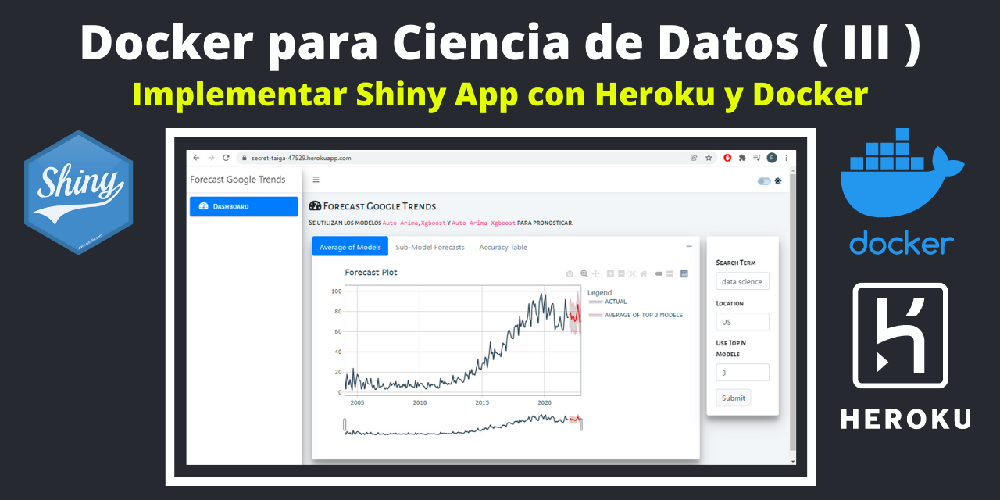

En la [**Primera Parte**](https://francisco-data.netlify.app/posts/2021-12-14-docker-ds-part-1/) de **Docker para Ciencia de Datos** se hizo un breve introducción de los principales terminos de **Docker** y las bondades de crear **entornos aislados** para **ejecutar** un aplicación de **Shiny**.

En la [**Segunda Parte**](https://francisco-data.netlify.app/posts/2021-12-20-dockerizar-shiny/) de **Docker para Ciencia de Datos** se explica como implementar una Shiny App con Docker para que sea fácil de reproducir, implementar y escalar.

Ahora en este **Tercera Parte**, se explica una breve guía sobre cómo implementar de una Shiny App con **Heroku** y **Docker**. Los dashboards en Shiny son una herramienta muy poderosa, pero un desafío importante es la implementación (**deployment**) para mostrar al público o como parte de tu portafolio de proyectos.

El objetivo es mostrar una Shiny App en la web y todos puedan consumirlo gracias al servicio de Heroku.


[**Heroku**](https://devcenter.heroku.com/articles/heroku-cli) es un servicio en la nube que ofrece una forma fácil de implementar una App a través del CLI o el panel de Heroku.

Las apps de **Heroku** se ejecutan en "dynos", que son contenedores que se ejecutan en AWS. Con el nivel gratuito, puede ejecutar aplicaciones en un máximo de 5 dynos. En el nivel gratuito, las app pasan al "modo de suspensión" después de 30 minutos y deben activarse, el tiempo de carga en la primera solicitud será de 10 a 30 segundos más.

**PASO 1: INSTALAR EL CLI DE HEROKU**

Como pre requisito debe crear una cuenta en Heroku y luego debe instalar el **CLI de Heroku** en tu ordenador. 

La interfaz de línea de comandos de Heroku (CLI) facilita la creación y administración de sus aplicaciones de Heroku directamente desde el terminal. Es una parte esencial del uso de Heroku.

<https://devcenter.heroku.com/articles/heroku-cli>


**PASO 2: IMAGEN DE DOCKER DE LA SHINY APP**

En la [**Segunda Parte**](https://francisco-data.netlify.app/posts/2021-12-20-dockerizar-shiny/) de **Docker para Ciencia de Datos** se explica como implementar una Shiny App con Docker para que sea fácil de reproducir, implementar y escalar. 

Basado en lo anterior, hay que hacer una pequeña modificación del archivo **Dockerfile**.

```bash
FROM rocker/tidyverse:latest
COPY . /GT_Dashboard
WORKDIR /GT_Dashboard
EXPOSE 5024
RUN install2.r --error \
    shiny \
    shinydashboard  \
    bs4Dash  \
    gtrendsR  \
    tidymodels  \
    modeltime  \
    timetk  \
    plotly  \
    reactable  \
    shinycssloaders  \
    lubridate

RUN chmod -R 755 /GT_Dashboard

RUN useradd shiny_user
USER shiny_user

CMD ["Rscript", "starter.R"]
```

**Heroku** proporciona un puerto aleatorio a través de la variable PORT de host para cada dyno. Para ejecutar la aplicación Shiny en este puerto hay que cambiar la variable port en **Starter.R** **`port = as.numeric(Sys.getenv('PORT'))`** en la instrucción **runApp**.


```bash
library(shiny)
shiny::runApp('./', port = as.numeric(Sys.getenv('PORT')), host="0.0.0.0")
```


**PASO 3: IMPLEMENTAR IMAGEN DOCKER SHINY APP EN HEROKU**

**Heroku Container Registry** le permite implementar sus imágenes de Docker en Heroku.

https://devcenter.heroku.com/articles/container-registry-and-runtime

Asegúrese de tener encendido Docker y luego inicie sesion en Heroku. Para esto, ejecute los siguientes comandos en la terminal de comandos de windows **cmd** (ejecute dentro de la carpeta del proyecto shiny)

```bash
heroku login
```

Inicie sesión en Container Registry:

```bash
heroku container:login
```

Cree una aplicación Heroku.

```bash
heroku create
```

Heroku le creara una url de la app con un nombre aleatorio que luego debe ser cambiada: 

`https://secret-taiga-47529.herokuapp.com/`

Cree la imagen y envíela a Container Registry, debe copiar el nombre de la app: `secret-taiga-47529`. Este proceso puede tomar varios minutos.

```bash
heroku container:push web -a secret-taiga-4752
```

Luego suelta la imagen en tu aplicación:

```bash
heroku container:release web -a secret-taiga-47529
```

Finalmente, en el navegador puede ver su Shiny App envio y en directo:

<https://secret-taiga-47529.herokuapp.com/>


