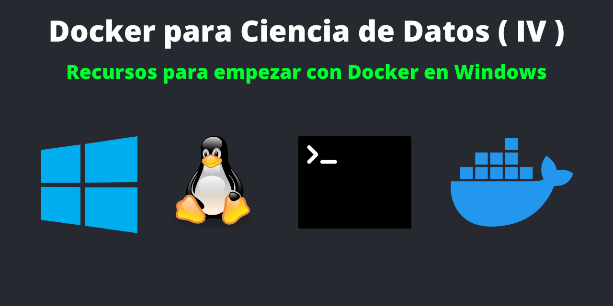
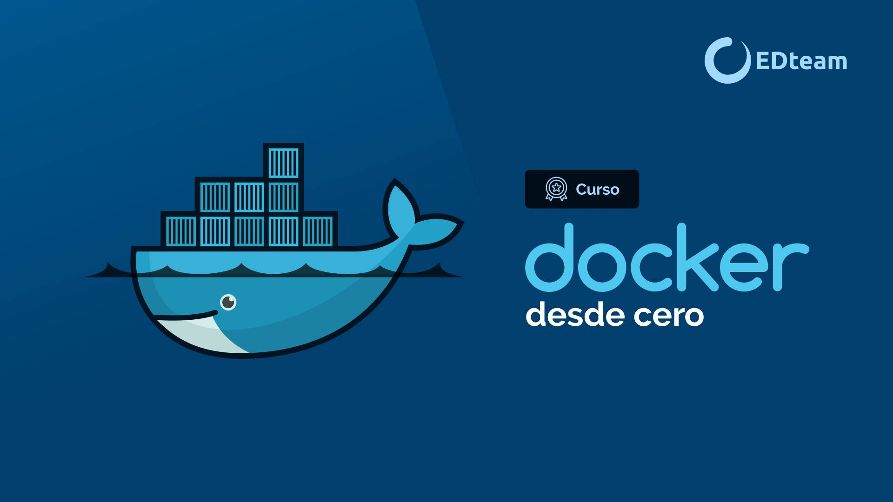

En la [**Primera Parte**](https://francisco-data.netlify.app/posts/2021-12-14-docker-ds-part-1/) de **Docker para Ciencia de Datos** se hizo un breve introducción de los principales terminos de **Docker** y las bondades de crear **entornos aislados** para **ejecutar** un aplicación de **Shiny**.

En la [**Segunda Parte**](https://francisco-data.netlify.app/posts/2021-12-20-dockerizar-shiny/) de **Docker para Ciencia de Datos** se explica como implementar una Shiny App con Docker para que sea fácil de reproducir, implementar y escalar.

En la [**Tercera Parte**](https://francisco-data.netlify.app/posts/2021-12-22-docker-ds-part-3/), se explica una breve guía sobre cómo implementar de una Shiny App con **Heroku** y **Docker** para mostrarlo al público en la web.

En esta **Cuarta Parte** de **Docker para Ciencia de Datos** te muestro varios recursos para empezar. Ya que si son usuarios de Windows, como yo, hay que hacer una series de pasos previos y conocer de la herramienta de docker. Adicionalmente se debe conocer un poco de comandos de **Linux**.

La instalación de Docker en Windows en un poco laboriosa, debido que hay habilitar la **Virtualización** y el **WLS** (Windows Subsystem for Linux) para usar Linux dentro de Windows, y todo esto es para poder correr  Docker dentro de Ubuntu conrriendo sobre Windows 10. 

Suena un poco complicado pero dejo unos recursos para instalar y aprender Docker en Windows:

**INSTALACIÓN DE DOCKER EN WINDOWS**

**Video 1** sobre como **instalar Docker en Windows** y los requisitos del sistema:

<iframe width="560" height="315" src="https://www.youtube.com/embed/dtPWnj5PKRg" title="YouTube video player" frameborder="0" allow="accelerometer; autoplay; clipboard-write; encrypted-media; gyroscope; picture-in-picture" allowfullscreen></iframe>

**LINUX EN WINDOWS**

**Video 2** sobre Linux en Windows:

<iframe width="560" height="315" src="https://www.youtube.com/embed/gm-Kym2iqss" title="YouTube video player" frameborder="0" allow="accelerometer; autoplay; clipboard-write; encrypted-media; gyroscope; picture-in-picture" allowfullscreen></iframe>

**WLS (Windows Subsystem for Linux)**

**Video 3** sobre WLS 2 con Docker:

<iframe width="560" height="315" src="https://www.youtube.com/embed/5RQbdMn04Oc" title="YouTube video player" frameborder="0" allow="accelerometer; autoplay; clipboard-write; encrypted-media; gyroscope; picture-in-picture" allowfullscreen></iframe>

**CURSO PRACTICO DE DOCKER**

**Video 4** de curso práctico de Docker:

<iframe width="560" height="315" src="https://www.youtube.com/embed/NVvZNmfqg6M" title="YouTube video player" frameborder="0" allow="accelerometer; autoplay; clipboard-write; encrypted-media; gyroscope; picture-in-picture" allowfullscreen></iframe>

**CURSO DE PAGO DE DOCKER**

**Cómo puedo empezar con Docker?**

Hay un curso muy práctico para aprender sobre Docker desde cero en la plataforma EDTEAM:

Si accedes con el siguiente link o con el codigo: 342602, obtienes descuentos en tu suscripción:

**<https://ed.team/premium?cupon=REF-342602>**

