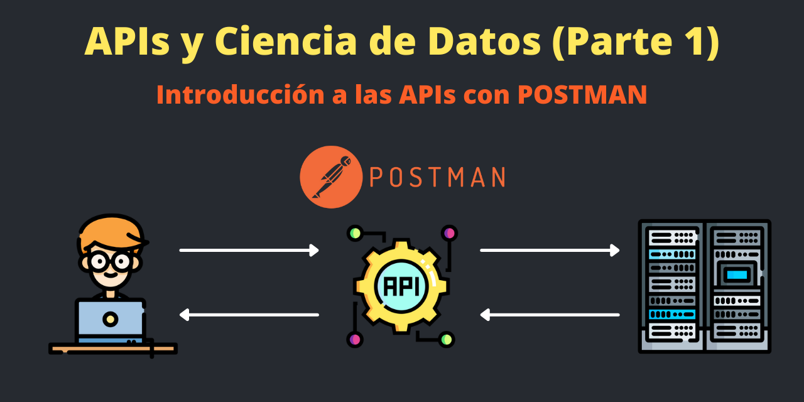

**👉 API**

Una **Application Programming Interface** (**Interfaz** de programación de aplicaciones), abreviado como **API**, es un conjunto de **subrutinas**, **funciones** y **procedimientos** (o métodos, en la programación orientada a objetos) que ofrece un software para que otro software pueda interactuar con aquel. También el propio software puede crear una API para que pueda interactuar consigo mismo.

Por ejemplo: El Lenguaje de Programación de **Python** ofrece sus funciones y métodos para realizar tareas predefinidas, es decir, Python nos ofrece una API para poder interactuar con un software.

**👉 API REST**

Las **API REST** son un tipo de API específicas para crear **aplicaciones WEB** o **móviles** que se conecten a un servidor vía **CLIENTE-SERVIDOR**. 

Las API REST permite exponer **funciones** para que un **cliente** (navegador, aplicación móvil) se conecten a nuestra aplicación del Backend.

Las **API REST** se basan en el **protocolo http** para exponer su arquitectura.


**👉 PROTOCOLO HTTP**

Un protocolo es un conjunto de reglas a seguir, este caso, un **protocolo http** es el protocolo de la web que permite intercambiar información en la web (CLIENTE – SERVIDOR) mediante un serie de **reglas estándares**.

Un **servidor** espera peticiones, si la petición del cliente contiene le protocolo correcto, entonces, el servidor devuelve la información solicitada.

El **Protocolo Http** es un protocolo usado por la arquitectura API REST.


**👉 METODOS DE PETICION HTTP**

Para hacer peticiones a servidores se utilizan métodos o **verbos HTTP** estándares que sirve para especificar el tipo de petición al servidor. 

A continuación se listan los tipos de peticiones mas frecuentes e importantes:

**GET**

Esta petición sirve para obtener información de parte del servidor. Por ejemplo: obtener listados de personas, películas, etc.

**POST**

Este método sirve para enviar información, desde el cliente al servidor, para crear nuevos recursos. Por ejemplos: usuarios, comentarios, likes, etc.

**PUT**

Este método sirve para actualizar un recurso ya existente, cambiándoles las propiedades.

**DELETE**

Este método sirve para borrar un recurso.

**PATCH**

Este método sirve para actualizar parcialmente un recurso. PUT en teoría actualiza todo el recurso, pero PATCH solo una parte del recurso.

**HEADER**

Este método solo sirve para consultar la existencia de un recurso 

**OPTIONS**

Este método lo utilizan los navegadores de forma nativa. Mediante el método OPTIONS los navegadores validan si un dominio puede recibir o hacer peticiones desde otro dominio. Sirve para evitar que hagan ataques tipo CORS (Cross-Origin Resource Sharing).

**👉 CODIGOS DE RESPUESTA HTTP**

Cuando se hace una petición al servidor, este nos envia unos códigos de respuesta estándares para determinar el estado de solicitud procesada.

Estos son los códigos de respuestas más frecuentes e importantes y están agrupados en **intervalos de 100**.


👉 Los códigos entre **200 y 299** son los códigos que todos queremos ver como respuesta del servidor, porque indica que la petición fue enviada correctamente y el proceso tanto del cliente como el servidor salió todo bien.

👉 Los códigos del **300 al 399** que da el servidor indica que un recurso fue movido temporal o permanentemente por alguna razón.

👉 Los códigos del **400 al 499** que da el servidor indica que cliente hizo una petición que no existe o mal hecha. Por ejemplo hacer una petición a un sitio web que no existe.

👉 Los códigos del **500 a 599**son errores que ocurren del lado del servidor, por ejemplo, cuando un servidor esta caído. 

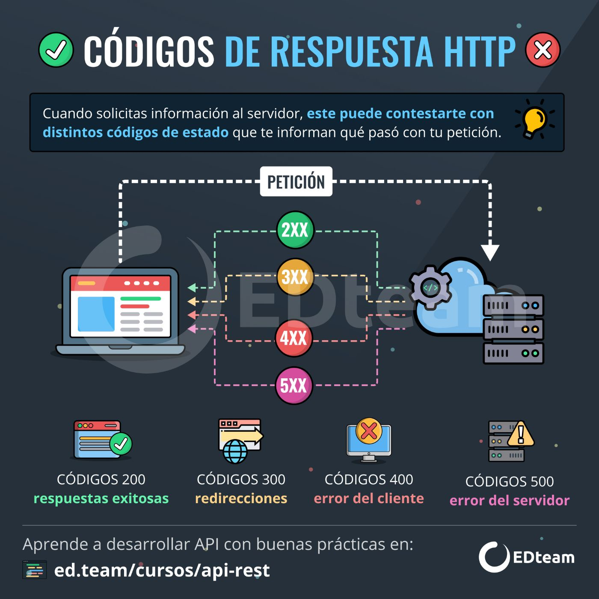

**👉 CABECERAS EN PROTOCOLOS HTTP**

Las cabeceras es un espacio destinado para enviar metadata en la petición HTTP, por ejemplo, enviar tokens de autenticación.


**👉 FORMATO JSON**

**JSON** son las siglas de JavaScript Object Notation. JSON se ha convertido en la forma principal en que los datos se transportan a través de las API. La mayoría de las API enviarán sus respuestas en formato JSON.
JSON tiene el formato de una serie de pares clave-valor entre llaves:

```bash
{
    "name": "Francisco",
    "last_name": "Zambrano"
}
```

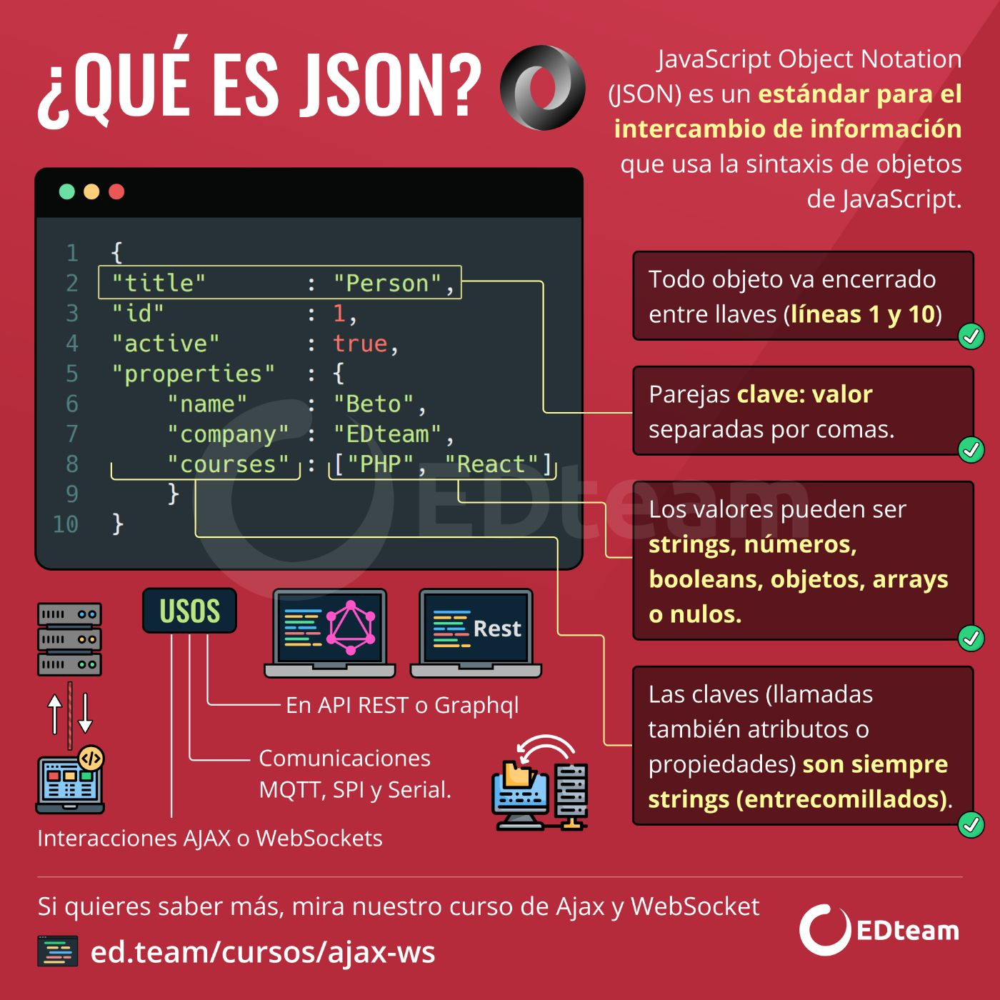


**👉 QUE ES POSTMAN?**


Es una plataforma para testear APIs y crear APIs se puede usar de forma local en el computador o en la web.

**<https://www.postman.com/>**

**Postman echo** es una API de Postman que sirve para aprender hacer solicitudes. Nos valemos de una URL la cual vamos a hacer peticiones al servidor. 

**<https://postman-echo.com>**


**👉 HACIENDO PETICIONES CON POSTMAN**

Como primer paso hay que crearse una cuenta en **Postman**, es muy facil y gratis.

Luego, debe crear un espacio de trabajo en Postman en **Create Workspace**:

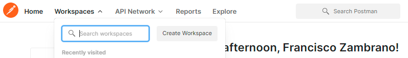


En el signo mas (+) puede abrir pestañas para crear las peticiones:

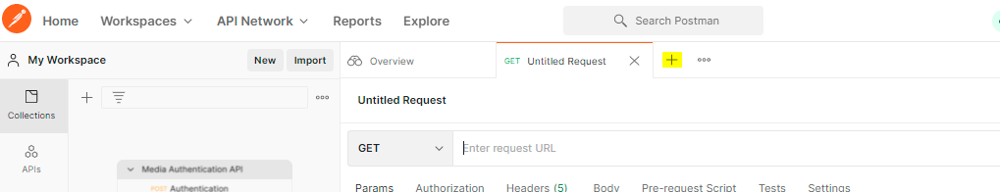


Puede explorar los tipos de peticiones que mencionamos anteriormente:

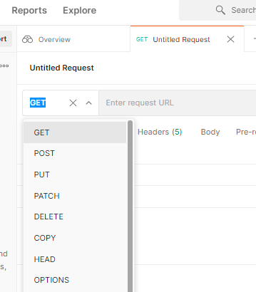


Para hacer una petición tipo **GET** se debe escribir la URL de **Postman echo** seguido de **/GET**

```bash
https://postman-echo.com/get
```


Lo que devuelve la petición GET son varias cosas: el **codigo de respuesta**: 200 OK, un campo vacío de argumentos, dado que también se puede enviar argumentos en GET. También hay información de cabeceras como el token y también la información de la url.

Las peticiones tipo **GET** también pueden llevar argumentos, o enviar datos. Por ejemplo:

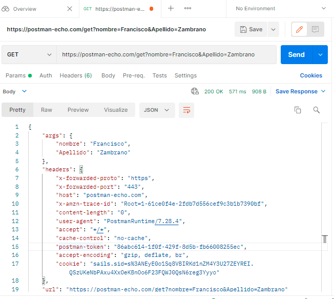

Para realizar peticiones tipo **POST** hay que indicar los parámetros, pero no desde la URL aunque si se puede pero no es lo recomendable, sino en el cuerpo de la petición. En Postman podemos simular un envío de información desde un **formulario web**, escogiendo la opcion **Body** y **x-www-urlencoded**

```bash
https://postman-echo.com/post
```

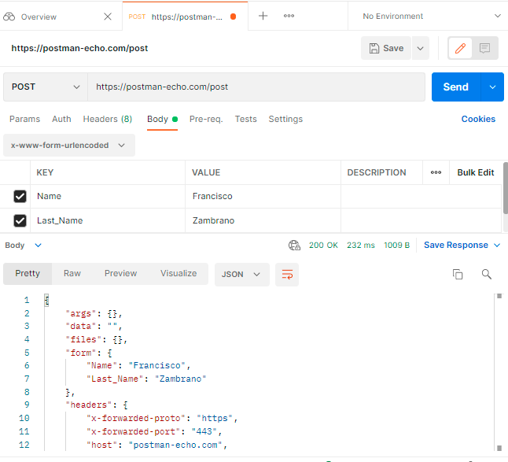

Podemos simular el envío de información en texto plano en **POST**:

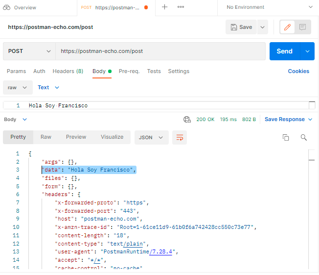


Podemos simular el envio de información en formato Json, en **POST**:

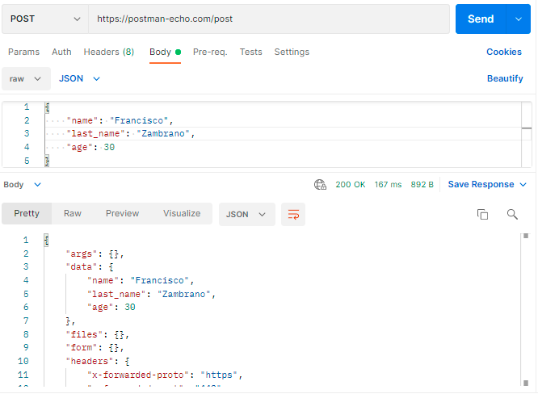


En Postman podemos simular hacer peticiones tipo **PUT**, como la actualización de un recurso, enviando en formato Json:

```bash
https://postman-echo.com/put
```

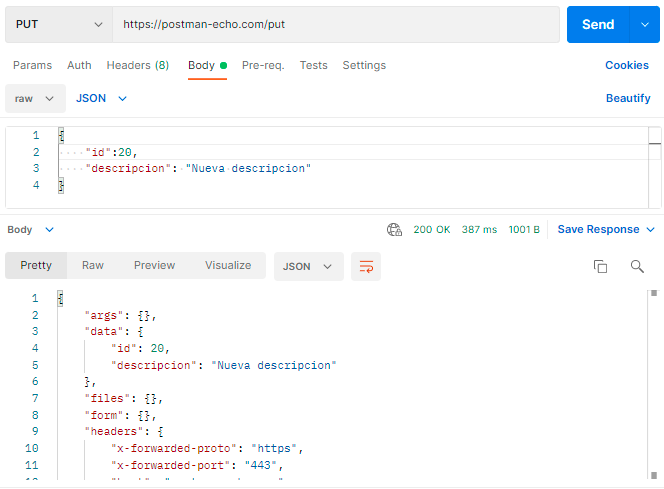


En Postman podemos simular hacer peticiones tipo **DELETE** para eliminar un recurso, enviando en formato Json:

```bash
https://postman-echo.com/delete
```

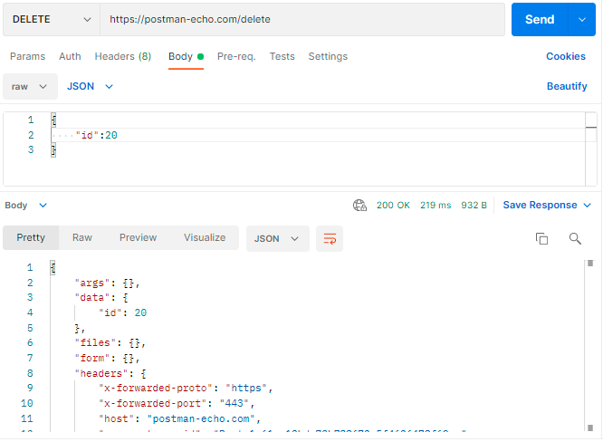


Recomiendo los siguientes recursos para seguir profundizando en APIs y POSTMAN:

Un curso gratuito de API REST en la plataforma Edteam:

**<https://ed.team/cursos/api-rest>**

Un curso de pago de POSTMAN: **<https://ed.team/cursos/postman>**

Si accedes con el siguiente link o con el codigo: 342602, obtienes descuentos en tu suscripción:

**<https://ed.team/premium?cupon=REF-342602>**


