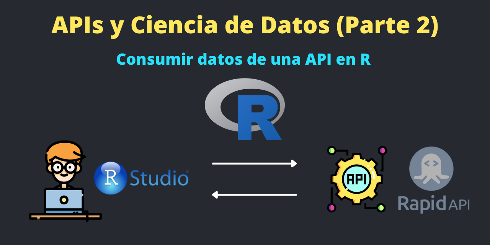

Utilidad de las APIs
==========================================================

Existen muchos sitios web que ofrecen conjuntos de datos gratuitos para hacer Ciencia de Datos, pero las APIs son otra forma de adquirir muchos datos limpios. 

En el [post anterior](https://francisco-data.netlify.app/posts/2021-12-30-api-data-science-1/) se explica lo necesario para empezar en el mundo de las API.

En este post se explica de forma práctica como consumir APIs en R. Aunque existen algunas API que tienen librerias en R para poder interactuar, no todas la API tienen librerias desarrolladas para R. Por suerte, podemos extraer informacion de las API con otras librerias como **`httr`** y **`jsonlite`**.


Librerias y funciones a usar
========================================================

La libreria **`httr`** permite interactuar con las API web. Vea la documentación completa del **`paquete httr`** aqui: <https://httr.r-lib.org//index.html>

La libreria **`jsonlite`** se utilizará para tranformar datos **`JSON`** en objeto R.

```{r message=FALSE, warning=FALSE}
library(httr)
library(jsonlite)
```

Las funciones principales a usar son **`GET()`** para hacer peticiones y **`fromJSON()`** para convertir un JSON en un objeto R (lista, Data Frame, etc). Existen otras funciones como **`add_headers()`** para enviar parametros de consulta dentro del **`GET()`**.

> ES importante revisar la documentacion de cada API, ya que muchas detallan bien y con ejemplos como realizar las peticiones en diferentes lenguajes de programación.

API # 1: PokeAPI
=========================================

PokeAPI en una API Rest <https://pokeapi.co/> que tiene toda la base de datos de Pokémon. Esta API es solo de consumo, es decir, admite el método **`GET`**. Tampoco requiere de autenticación para acceder a esta API.

La ruta que permitirá buscar pokémones por nombre o por ID será:

**`https://pokeapi.co/api/v2/pokemon/{pokemonId}`**

Comenzamos haciendo la solicitud usando la función **`GET()`** y especificando la **URL** de la API:

```{r}
url = "https://pokeapi.co/api/v2/pokemon/25"
datos <- GET(url)
datos
```

Nos da un resumen de la respuesta: la url, fecha solicitud, status con el codigo de respuesta, el tipo de contenido que un JSON y el tamano de la respuesta. El numero del status es 200, lo que indica que fue una solicitud y respuesta exitosa.

Tranformanos la respuesta JSON en objeto R, en este caso una lista:

```{r message=FALSE, warning=FALSE}
datos <- fromJSON(content(datos, type = "text"))
```

```{r}
class(datos)
```

Accedemos al arbol de la lista, en este caso a toda la informacion del pokemon cuyo ID es 25:

```{r}
# Nombre
datos[["name"]]
```


```{r}
# Experiencia
datos[["base_experience"]]
```

```{r}
# Ataque
datos[["stats"]][["base_stat"]][2]
```

```{r}
# Defensa
datos[["stats"]][["base_stat"]][3]
```

```{r}
# URL de la imagen
datos[["sprites"]][["other"]][["home"]][["front_default"]]
```


Si desea ver la imagen en Rstudio:

```r
library(magick)
image_url <- datos[["sprites"]][["other"]][["home"]][["front_default"]]
pic <- image_read(image_url)
print(pic)
```

API # 2: COVID-19 Statistics de RapidAPI
===============================================

[RapidAPI](https://rapidapi.com/hub) es un sitio web con muchas APIs publicas y privadas. Solo hay que registrarse para obtener la API Key para poder hacer las peticiones. 

Muchas APIs tienen muy buena documentación con ejemplos de código en diferentes lenguajes de programación.

En este caso hare una petición a una API de **COVID-19** para obtener la informacion respectiva sobre el Covid de los paises. En la documentación de esta API indica la URL y headers a utilizar 

<https://rapidapi.com/axisbits-axisbits-default/api/covid-19-statistics/>


```{r}
url = "https://covid-19-statistics.p.rapidapi.com/reports"
```

```r
headers = add_headers(
  'x-rapidapi-host'= 'covid-19-statistics.p.rapidapi.com',
  'x-rapidapi-key'= '0875ddxxxxxxxxmshf61873b0xxxxxxxxxxxxxxxxxxxxxxx'
)
```

```{r echo = FALSE}
headers = add_headers(
  'x-rapidapi-host'= 'covid-19-statistics.p.rapidapi.com',
  'x-rapidapi-key'= '0875dde810mshf61873b07e11f6ap1996c5jsnbccd334ffe2b'
)
```

```{r message=FALSE, warning=FALSE}
datos2 <- GET(url, headers)

datos2 <- fromJSON(content(datos2, type = "text"))
```


```{r}
library(rmarkdown)

paged_table(datos2[["data"]])
```


```{r}
paged_table(datos2[["data"]][["region"]])
```


Tambien se puede agregar mas parámetros al método GET como una **query** para obtener información mas específica:

```{r}
queryString <- list(
  city_name = "Autauga",
  region_province = "Alabama",
  iso = "USA",
  region_name = "US",
  q = "US Alabama",
  date = "2020-04-16"
)
```

```{r message=FALSE, warning=FALSE}
datos3 <- GET(url, query = queryString,  headers)
datos3 <- fromJSON(content(datos3, type = "text"))
```

```{r}
paged_table(datos3[["data"]])
```

```{r}
paged_table(datos3[["data"]][["region"]])
```


BONUS:
=============================================

Existen muchos sitios web donde encontran APIs gratuitas para probar y realizar proyectos:

- [RapidAPI](https://rapidapi.com/hub). Aqui existen muchas APIs para hacer Ciencia de Datos, hay que registrase para obtener una API KEY. Algunas APIs tienen limitaciones pero hay mucha documentación.
- [Public APIs](https://github.com/public-apis/public-apis). Aqui existen una lista grande de muchas APIs publicas.
- [API de Marvel](https://developer.marvel.com/docs). Esta API necesita registrase para obtener la API Key, 1K llamadas/día y se necesita atribución.
- [PokeAPI](https://pokeapi.co/). Es una de las APIs más usadas. Sin límite, ni API KEY, ni atribución.
- [API Harry Potter](https://hp-api.herokuapp.com/). Esta API no es necesaria API KEY.
- [API de Dragon Ball](https://dragon-ball-api.herokuapp.com/documentation).
- [API de video juegos](https://api-docs.igdb.com/).
- [API de Star Wars](https://swapi.dev/).
- [API de Rick & Morty](https://rickandmortyapi.com/)


Conclusión
===========================================

En este post vimos lo fácil y rápido que es consumir datos de una API para luego poder realizar Ciencia de Datos.


