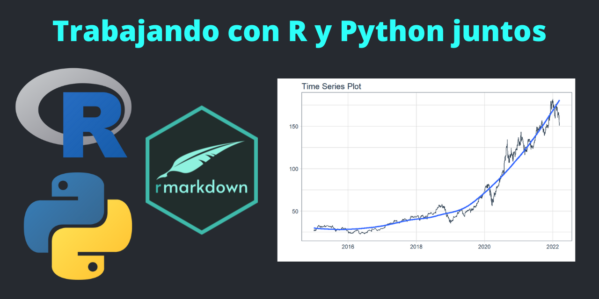
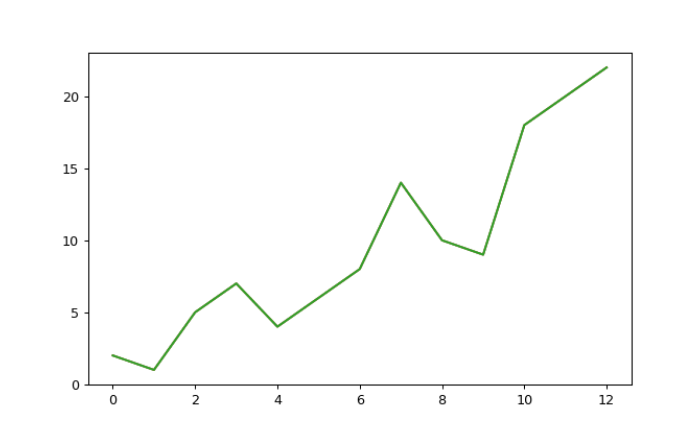

Descargar e Instalar Conda
=======================================

Vea la instrucciones de instalación: <https://docs.anaconda.com/anaconda/install/>

Una vez instalado Anaconda, siguientes pasos debe realizarse en la **terminal de anaconda**.

Crear un nuevo entorno de Python
======================================

Para crear un entorno nuevo de Python debe ejecutar el siguiente codigo en la Terminal de Anaconda: (solo se debe realizar una sola vez)

```bash
conda create -n py3.8 python=3.8 scikit-learn pandas numpy matplotlib
```
El codigo anterior crea un entorno de python de nombre **`py3.8`** (le puedes poner otro nombre) con la **version 3.8 de Python** y adicionalmente se instala las ultimas versiones de **scikit-learn**, **pandas**, **Numpy** y **Matplotlib**. Mas adelante se puede instalar mas paquetes a este entorno creado.

Listar los entornos Conda 
=======================================

Para ver un **listado** de los entornos que hayamos creado ejecute el siguiente código en la Terminal de Anaconda:

```bash
conda list env
```
Si ves **`py3.8`** en la lista es porque se creó correctamente.

Activar el entorno creado
=====================================

Para **activar** y usar el entorno creado **`py3.8`** ejecute el siguiente código en la Terminal de Anaconda:

```bash
conda activate py3.8
```

Listar los paquetes un entorno
===================================

Para listar los paquetes del entorno activado ejecute el siguiente código en la Terminal de Anaconda:

```bash
conda list
```

Otra forma de listar paquetes:

```bash
conda env export
```

Instalación de paquetes en un entorno
========================================

Para **verificar** si un paquete esta instalado:

```bash
conda list html5lib
```

Para **enumerar** todos los paquetes en un entorno desactivado:

```bash
conda list -n <my env>
```

Para **actualizar** los paquetes del entorno:

```bash
conda update --all
```

Para **instalar** un paquete en el entorno:

```bash
conda install <package_name>
```
o también:

```bash
conda install -c conda-forge <package_name>
```

Una vez realizado lo anterior podemos usar Python en RMarkdown o Shiny App.


Python en RMarkdown
===========================================

Primero debe crear un nuevo documento RMarkdown y luego cargar el paquete **`reticulate`** para usar Python.

```{r message=FALSE, warning=FALSE}
library(tidyverse)
library(reticulate)
```

Listar los entornos de Conda en RMarkdown:

```{r}
reticulate::conda_list()
```

Activar el entorno py3.8 en R Markdown:

```{r}
use_condaenv("py3.8", required = TRUE)
```

Verificar que reticulate esté usando el entorno py3.8 en R Markdown:

```{r}
py_config()
```

Realizar la prueba en un **chunk** Python:

```{python}
1 + 1
```

Adicionalmente puede convertir la consola de rstudio en consola de python: 

```bash
repl_python()
```
Use Esc para salir.


Probando Numpy, Pandas y Matplotlib
================================================

En el documento RMarkdown puede utilizar las funciones de Python mediante un **chunk** Python:

```{python}
import numpy as np
import pandas as pd
import matplotlib.pyplot as plt
```

**Usando Numpy**

```{python}
a = np.array([[1, 2, 3, 4], [5, 6, 7, 8], [9, 10, 11, 12]])
print(a)
```

```{python}
a.ndim
```

```{python}
a.shape
```

**Usando Pandas**

```{python}
df = pd.DataFrame(a)
print(df)
```

```{python}
df.to_csv('pd.csv')
```

```{python}
data = pd.read_csv('pd.csv')
print(data)
```

**Usando Matplotlib**

```{python}
b = np.array([2, 1, 5, 7, 4, 6, 8, 14, 10, 9, 18, 20, 22])
print(b)
```


```python
plt.plot(b)
plt.show()
```




Combinando Python y R
================================================

Ahora instalaremos un paquete nuevo en nuestro entorno conda para extraer datos de las api de Yahoo Finance con Python para luego graficarlos con R

Ejecutar en la **terminal de anaconda** en el entorno **`py3.8`**.

```bash
conda install yfinance
```

Volviendo a nuestro documento RMarkdown cargamos la librerias de Python:

```{python}
from datetime import date

# Para descargar datos de Yahoo Finance
import yfinance as yf
```

Creamos variables:

```{python}
START = "2015-01-01"
TODAY = date.today().strftime("%Y-%m-%d")
stocks = ('AAPL')
```

Creamos una función:

```{python}
def load_data(ticker):
    data = yf.download(ticker, START, TODAY)
    data.reset_index(inplace=True)
    return data

```

Aplicamos la función de extración de datos:

```{python}
data = load_data(stocks)
```

Ahora que obtuvimos un data frame en Python podemos usarlo en R para graficarlo (debe anteponer **`py$`**). Tambien se puede tomar un Data Frame de R y utilizarlo en Python.

```{r message=FALSE, warning=FALSE}
library(timetk)
```

```{r message=FALSE, warning=FALSE}
py$data %>% 
  plot_time_series(Date, Close, .interactive = F)
```


Scikit-Learn en RMarkdown
========================================

Ahora aplicaremos un algoritmo KMeans de Scikit-Learn de Python.

```python
import numpy as np
import matplotlib.pyplot as plt

from sklearn.cluster import KMeans
from sklearn.datasets import make_blobs

plt.figure(figsize=(12, 12))

n_samples = 1500
random_state = 170
X, y = make_blobs(n_samples=n_samples, random_state=random_state)

# Incorrect number of clusters
y_pred = KMeans(n_clusters=2, random_state=random_state).fit_predict(X)

plt.subplot(221)
plt.scatter(X[:, 0], X[:, 1], c=y_pred)
plt.title("Incorrect Number of Blobs")

# Anisotropicly distributed data
transformation = [[0.60834549, -0.63667341], [-0.40887718, 0.85253229]]
X_aniso = np.dot(X, transformation)
y_pred = KMeans(n_clusters=3, random_state=random_state).fit_predict(X_aniso)

plt.subplot(222)
plt.scatter(X_aniso[:, 0], X_aniso[:, 1], c=y_pred)
plt.title("Anisotropicly Distributed Blobs")

# Different variance
X_varied, y_varied = make_blobs(
    n_samples=n_samples, cluster_std=[1.0, 2.5, 0.5], random_state=random_state
)
y_pred = KMeans(n_clusters=3, random_state=random_state).fit_predict(X_varied)

plt.subplot(223)
plt.scatter(X_varied[:, 0], X_varied[:, 1], c=y_pred)
plt.title("Unequal Variance")

# Unevenly sized blobs
X_filtered = np.vstack((X[y == 0][:500], X[y == 1][:100], X[y == 2][:10]))
y_pred = KMeans(n_clusters=3, random_state=random_state).fit_predict(X_filtered)

plt.subplot(224)
plt.scatter(X_filtered[:, 0], X_filtered[:, 1], c=y_pred)
plt.title("Unevenly Sized Blobs")

plt.show()
```


```{python echo=FALSE}
import numpy as np
import matplotlib.pyplot as plt

from sklearn.cluster import KMeans
from sklearn.datasets import make_blobs

plt.figure(figsize=(12, 12))

n_samples = 1500
random_state = 170
X, y = make_blobs(n_samples=n_samples, random_state=random_state)

# Incorrect number of clusters
y_pred = KMeans(n_clusters=2, random_state=random_state).fit_predict(X)

plt.subplot(221)
plt.scatter(X[:, 0], X[:, 1], c=y_pred)
plt.title("Incorrect Number of Blobs")

# Anisotropicly distributed data
transformation = [[0.60834549, -0.63667341], [-0.40887718, 0.85253229]]
X_aniso = np.dot(X, transformation)
y_pred = KMeans(n_clusters=3, random_state=random_state).fit_predict(X_aniso)

plt.subplot(222)
plt.scatter(X_aniso[:, 0], X_aniso[:, 1], c=y_pred)
plt.title("Anisotropicly Distributed Blobs")

# Different variance
X_varied, y_varied = make_blobs(
    n_samples=n_samples, cluster_std=[1.0, 2.5, 0.5], random_state=random_state
)
y_pred = KMeans(n_clusters=3, random_state=random_state).fit_predict(X_varied)

plt.subplot(223)
plt.scatter(X_varied[:, 0], X_varied[:, 1], c=y_pred)
plt.title("Unequal Variance")

# Unevenly sized blobs
X_filtered = np.vstack((X[y == 0][:500], X[y == 1][:100], X[y == 2][:10]))
y_pred = KMeans(n_clusters=3, random_state=random_state).fit_predict(X_filtered)

plt.subplot(224)
plt.scatter(X_filtered[:, 0], X_filtered[:, 1], c=y_pred)
plt.title("Unevenly Sized Blobs")

plt.show()
```


